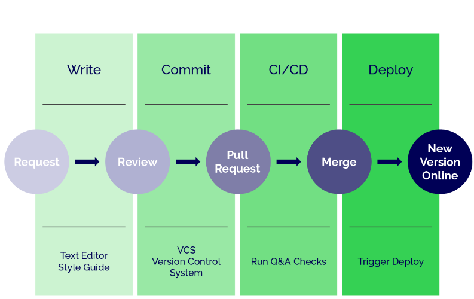

# Overview

::: tip Key Point
:bulb: How to use Continuous Integration for documentation quality assurance.
:::

Poor documentation reflects on the quality of [Plone](https://plone.org "Link to the website of Plone")
and us, the community.

We use the *Docs As Code* approach to apply a Quality Assurance (QA) model to our documentation process.

This means running documentation tests in the same manner that developers
run automated tests against the software they are writing.

