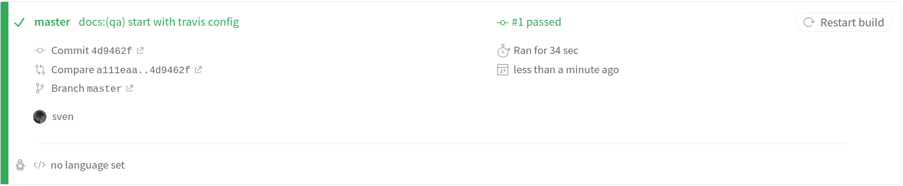

# Travis CI

::: tip Key Point
:bulb: How to use [Travis CI](https://travis-ci.org/ "Website of Travis CI") for documentation quality assurance.
:::



## Setup

We use containerised checks.

Below is an example (`.travis.yml`) of a basic configuration for Travis CI.

```yaml
---
language: generic
dist: xenial

services:
  - docker

stages:
  - test

jobs:
  include:
    - stage: test
      script:
      - docker run -v `pwd`/docs:/srv/test testthedocs/ttd-linkcheck docs
      - docker run --rm -i -v `pwd`:/lint/input:ro testthedocs/ttd-remark docs
```

### Configuration breakdown

#### Language

`language: minimal` and `language: generic` are images available in Ubuntu Xenial.

`dist: xenial` and Ubuntu Trusty `dist:trusty`, that are not tailored to any particular programming language.

As their names suggest, one is optimized be faster and use less disk space,
the other to have more languages and services available.

For more information, please check the [Travis CI documentation](https://docs.travis-ci.com/user/languages/minimal-and-generic/ "Link to Travis CI docs").

#### Docker

Travis CI builds can run and build Docker images.

To use Docker add the following settings to your .travis.yml:

```yaml
services:
  - docker
```

Please check the [Travis docs on Docker](https://docs.travis-ci.com/user/docker/ "Link to Travis docs on Docker" )
for more.

#### Build stages

Build stages is a way to group jobs, and run jobs in each stage in parallel,
but run one stage after another sequentially

Here’s how you’d set up the build configuration for this in your .travis.yml file:

```yaml
jobs:
  include:
    - stage: test
      script: ./test 1
    - # stage name not required, will continue to use `test`
      script: ./test 2
    - stage: deploy
      script: ./deploy
```

Check the docs about [build stages in the Travis docs](https://docs.travis-ci.com/user/build-stages/ "Link to Travis docs about build stages").

::: warning Note
This is basic example to give you an better picture.

We'll setup a production grade one in the future.
:::

## Working example

You can find a fully [working example](https://github.com/testthedocs/travis-ci-example "Link to example repo")
in the GitHub organization of TestTheDocs.
